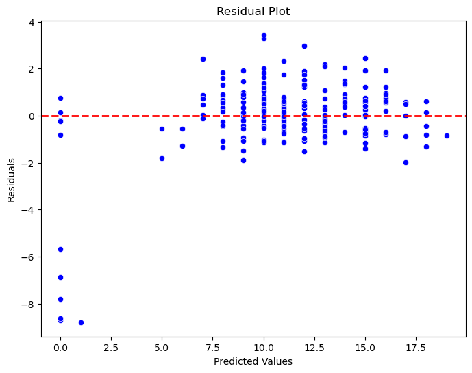

<!-- Improved compatibility of back to top link: See: https://github.com/othneildrew/Best-README-Template/pull/73 -->

<!--
*** Thanks for checking out the Best-README-Template. If you have a suggestion
*** that would make this better, please fork the repo and create a pull request
*** or simply open an issue with the tag "enhancement".
*** Don't forget to give the project a star!
*** Thanks again! Now go create something AMAZING! :D
-->

<!-- PROJECT SHIELDS -->
<!--
*** I'm using markdown "reference style" links for readability.
*** Reference links are enclosed in brackets [ ] instead of parentheses ( ).
*** See the bottom of this document for the declaration of the reference variables
*** for contributors-url, forks-url, etc. This is an optional, concise syntax you may use.
*** https://www.markdownguide.org/basic-syntax/#reference-style-links
-->

<!-- PROJECT LOGO -->
 

  

  <h3 align="center">Team Pere Pere</h3>

  

    
The university is positioned at the forefront of the initiative, charged with leveraging advanced analytics and machine learning to uncover patterns within the rich dataset. A fundamental requirement entails ensuring that the insights and recommendations developed by participants remain accessible to the broader public. The university's role extends beyond providing technical solutions; it involves bridging the gap, rendering valuable insights easily comprehensible and usable for the general public. This contribution plays a significant role in the democratization of education data and aligns with the principles of SDG 4. Consequently, the government anticipates the delivery of a prototype showcasing various insights and the application of predictive models.
     
  

<!-- TABLE OF CONTENTS -->

  
Table of Contents

  <ol>
    <li>
      <a href="#about-the-project">About The Project</a>
      <ul>
        <li><a href="#built-with">Built With</a></li>
      </ul>
    </li>
    <li>
      <a href="#dataset">About the Dataset</a>
      <ul>
        <li><a href="#prerequisites">Prerequisites</a></li>
        <li><a href="#installation">Installation</a></li>
      </ul>
    </li>
    <li><a href="#usage">Usage</a></li>
    <li><a href="#roadmap">Roadmap</a></li>
    <li><a href="#contributing">Contributing</a></li>
    <li><a href="#license">License</a></li>
    <li><a href="#contact">Contact</a></li>
    <li><a href="#acknowledgments">Acknowledgments</a></li>
  </ol>

<!-- ABOUT THE PROJECT -->
## About The Project

[![Product Name Screen Shot][product-screenshot]](https://example.com)

The Department of Education, Government of India, is currently immersed in an extensive investigation into the factors influencing student performance, aligning with the UN Sustainable Development Goal 4 - Quality Education. Conducting a thorough survey across schools, the government has meticulously collected comprehensive data, emphasizing a detailed analysis of socio-economic factors within families. This dataset provides crucial insights into the nuanced elements that impact educational outcomes.

This research initiative aims to dissect the influence of socio-economic factors on student performance. By democratizing accessible insights, the initiative empowers policymakers and educators to implement targeted interventions, fostering inclusive and equitable education. The overarching goal is to contribute to societal advancement in alignment with UN Sustainable Development Goal 4.

At the forefront of this transformative initiative is Team Pere Pere, tasked with employing advanced analytics and machine learning to uncover patterns within the rich dataset. A pivotal aspect of this endeavor is ensuring that the insights and recommendations developed by participants go beyond technical boundaries and are accessible to the wider public. The role is not merely to provide technical solutions but to bridge the gap, making valuable insights easily understandable and usable by the general public. This commitment represents a significant stride towards the democratization of education data, embodying the principles of SDG 4.

(<a href="#readme-top">back to top</a>)

<!-- GETTING STARTED -->
## Dataset
Dataset Information:
The data were obtained in a survey of students math and portuguese language courses in secondary school. It contains a lot of interesting social, gender and study information about students.
| Feature       | Description                                           |
|---------------|-------------------------------------------------------|
| school        | Student's school (binary: 'GP' - Gabriel Pereira or 'MS' - Mousinho da Silveira) |
| sex           | Student's sex (binary: 'F' - female or 'M' - male)    |
| age           | Student's age (numeric: from 15 to 22)                |
| address       | Student's home address type (binary: 'U' - urban or 'R' - rural) |
| famsize       | Family size (binary: 'LE3' - less or equal to 3 or 'GT3' - greater than 3) |
| Pstatus       | Parent's cohabitation status (binary: 'T' - living together or 'A' - apart) |
| Medu          | Mother's education (numeric: 0 - none, 1 - primary education (4th grade), 2 – 5th to 9th grade, 3 – secondary education or 4 – higher education) |
| Fedu          | Father's education (numeric: 0 - none, 1 - primary education (4th grade), 2 – 5th to 9th grade, 3 – secondary education or 4 – higher education) |
| Mjob          | Mother's job (nominal: 'teacher', 'health' care related, civil 'services', 'at_home' or 'other') |
| Fjob          | Father's job (nominal: 'teacher', 'health' care related, civil 'services', 'at_home' or 'other') |
| reason        | Reason to choose this school (nominal: close to 'home', school 'reputation', 'course' preference or 'other') |
| guardian      | Student's guardian (nominal: 'mother', 'father' or 'other') |
| traveltime    | Home to school travel time (numeric: 1 - <15 min., 2 - 15 to 30 min., 3 - 30 min. to 1 hour, or 4 - >1 hour) |
| studytime     | Weekly study time (numeric: 1 - <2 hours, 2 - 2 to 5 hours, 3 - 5 to 10 hours, or 4 - >10 hours) |
| failures      | Number of past class failures (numeric: n if 1<=n<3, else 4) |
| schoolsup     | Extra educational support (binary: yes or no)         |
| famsup        | Family educational support (binary: yes or no)        |
| paid          | Extra paid classes within the course subject (Math or Portuguese) (binary: yes or no) |
| activities    | Extra-curricular activities (binary: yes or no)       |
| nursery       | Attended nursery school (binary: yes or no)           |
| higher        | Wants to take higher education (binary: yes or no)    |
| internet      | Internet access at home (binary: yes or no)           |
| romantic      | With a romantic relationship (binary: yes or no)      |
| famrel        | Quality of family relationships (numeric: from 1 - very bad to 5 - excellent) |
| freetime      | Free time after school (numeric: from 1 - very low to 5 - very high) |
| goout         | Going out with friends (numeric: from 1 - very low to 5 - very high) |
| Dalc          | Workday alcohol consumption (numeric: from 1 - very low to 5 - very high) |
| Walc          | Weekend alcohol consumption (numeric: from 1 - very low to 5 - very high) |
| health        | Current health status (numeric: from 1 - very bad to 5 - very good) |
| absences      | Number of school absences (numeric: from 0 to 93)     |

| Grade | Description                                           |
|-------|-------------------------------------------------------|
| G1    | First period grade (numeric: from 0 to 20)            |
| G2    | Second period grade (numeric: from 0 to 20)           |
| G3    | Final grade (numeric: from 0 to 20, output target)    |

|                        |                          |
|------------------------|--------------------------|
| Total Number of Rows   | 395                      |
| Rows                   | 395                      |
| Duplicates             | None                     |
| Features               | 33                       |
| Categorical           | 29                       |
| Numerical              | 4                        |

### EDA

Here are some Analysis we found

<object data="https://github.com/FathimathSusnaAli/Hackthon_2k23/blob/7c4f4fc102a4b968b9f90a2b71495eecc8706184/Analysis%26EDA%20(1).pdf" type="application/pdf" width="700px" height="700px">
    <embed src="https://github.com/FathimathSusnaAli/Hackthon_2k23/blob/7c4f4fc102a4b968b9f90a2b71495eecc8706184/Analysis%26EDA%20(1).pdf">
        
This browser does not support PDFs. Please download the PDF to view it: <a href="http://yoursite.com/the.pdf">Download PDF</a>.

    </embed>
</object>

<!-- USAGE EXAMPLES -->
## Models

Here are some Modelling we performed

<object data="https://github.com/FathimathSusnaAli/Hackthon_2k23/blob/411a1fd4e3f981225cf64a49826c54f450b8a6e3/Our%20Approach.pdf" type="application/pdf" width="700px" height="700px">
    <embed src="https://github.com/FathimathSusnaAli/Hackthon_2k23/blob/411a1fd4e3f981225cf64a49826c54f450b8a6e3/Our%20Approach.pdf">
        
This browser does not support PDFs. Please download the PDF to view it: <a href="http://yoursite.com/the.pdf">Download PDF</a>.

    </embed>

<!-- Results -->
## Results

Here are some of the results of the visuals we performed for our 3 models 

| Model                        | R-squared (R2) | Mean Absolute Error (MAE) | Mean Squared Error (MSE) |
|------------------------------|----------------|---------------------------|--------------------------|
| Linear Regression            | 0.201084       | 2.122629                  | 7.009377                 |
| Decision Tree Regressor      | -0.315521      | 2.672249                  | 11.541866                |
| Support Vector Machine Regressor | 0.164724   | 2.18967                   | 7.328388                 |
| XGBoost Regressor            | 0.216802       | 2.074647                  | 6.871473                 |

<!-- MARKDOWN LINKS & IMAGES -->
<!-- https://www.markdownguide.org/basic-syntax/#reference-style-links -->
[contributors-shield]: https://img.shields.io/github/contributors/othneildrew/Best-README-Template.svg?style=for-the-badge
[contributors-url]: https://github.com/othneildrew/Best-README-Template/graphs/contributors
[forks-shield]: https://img.shields.io/github/forks/othneildrew/Best-README-Template.svg?style=for-the-badge
[forks-url]: https://github.com/othneildrew/Best-README-Template/network/members
[stars-shield]: https://img.shields.io/github/stars/othneildrew/Best-README-Template.svg?style=for-the-badge
[stars-url]: https://github.com/othneildrew/Best-README-Template/stargazers
[issues-shield]: https://img.shields.io/github/issues/othneildrew/Best-README-Template.svg?style=for-the-badge
[issues-url]: https://github.com/othneildrew/Best-README-Template/issues
[license-shield]: https://img.shields.io/github/license/othneildrew/Best-README-Template.svg?style=for-the-badge
[license-url]: https://github.com/othneildrew/Best-README-Template/blob/master/LICENSE.txt
[linkedin-shield]: https://img.shields.io/badge/-LinkedIn-black.svg?style=for-the-badge&logo=linkedin&colorB=555
[linkedin-url]: https://linkedin.com/in/othneildrew
[product-screenshot]: images/screenshot.png
[Next.js]: https://img.shields.io/badge/next.js-000000?style=for-the-badge&logo=nextdotjs&logoColor=white
[Next-url]: https://nextjs.org/
[React.js]: https://img.shields.io/badge/React-20232A?style=for-the-badge&logo=react&logoColor=61DAFB
[React-url]: https://reactjs.org/
[Vue.js]: https://img.shields.io/badge/Vue.js-35495E?style=for-the-badge&logo=vuedotjs&logoColor=4FC08D
[Vue-url]: https://vuejs.org/
[Angular.io]: https://img.shields.io/badge/Angular-DD0031?style=for-the-badge&logo=angular&logoColor=white
[Angular-url]: https://angular.io/
[Svelte.dev]: https://img.shields.io/badge/Svelte-4A4A55?style=for-the-badge&logo=svelte&logoColor=FF3E00
[Svelte-url]: https://svelte.dev/
[Laravel.com]: https://img.shields.io/badge/Laravel-FF2D20?style=for-the-badge&logo=laravel&logoColor=white
[Laravel-url]: https://laravel.com
[Bootstrap.com]: https://img.shields.io/badge/Bootstrap-563D7C?style=for-the-badge&logo=bootstrap&logoColor=white
[Bootstrap-url]: https://getbootstrap.com
[JQuery.com]: https://img.shields.io/badge/jQuery-0769AD?style=for-the-badge&logo=jquery&logoColor=white
[JQuery-url]: https://jquery.com 
